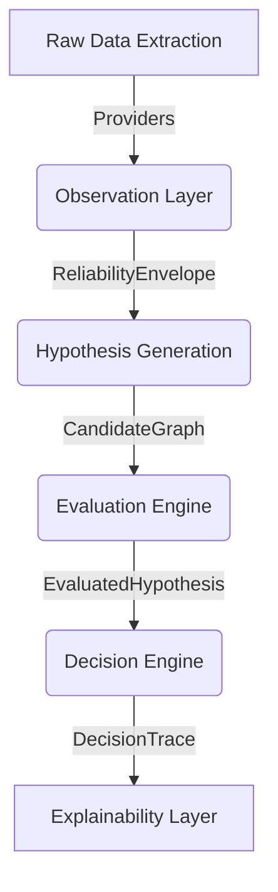
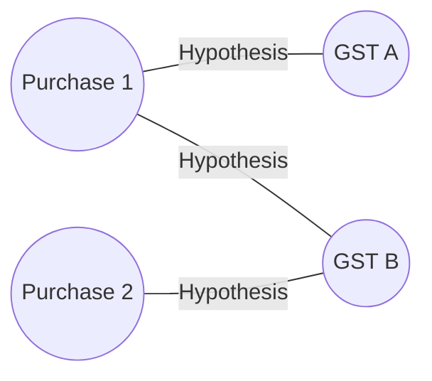
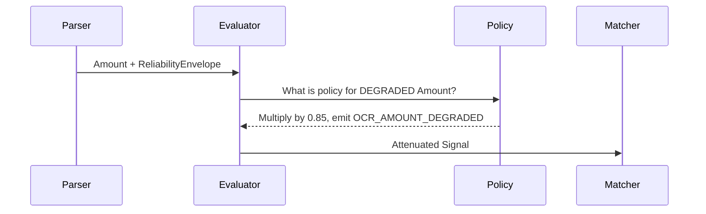

# ReconGraph Architecture

ReconGraph is a deterministic engine designed to solve $N:M$ reconciliation problems, primarily focusing on matching localized purchase records against official tax authority (GST) records.

ReconGraph replaces probabilistic matching, opaque machine learning confidence scores, and ad-hoc heuristics with a **strictly deterministic, graph-based evaluation engine**. It separates the act of *observing* data from the act of *interpreting* data, allowing for fully explainable, audit-ready financial reconciliations.

## High-Level Pipeline

The reconciliation process flows through a linear, directed acyclic pipeline. Each stage strictly produces immutable artifacts.

## Evidence Graph

ReconGraph models potential matches as a bipartite graph. Nodes represent records (e.g., Purchases and GSTs), and edges represent hypothesized matches.

The **Hypothesis Evaluator** takes subgraphs (e.g., $P1 + P2 \leftrightarrow G2$) and scores them based on canonical semantic projections, evaluating whether the combined financial assertions satisfy the rules of the domain.

## Reliability Flow (Observation Quality)

Data extracted via OCR or LLMs is inherently noisy. ReconGraph handles this noise via a **Universal Reliability Framework**.

1. **Extraction**: A parser extracts an amount. It attaches a `ReliabilityProfile` describing extraction quality (e.g., `DEGRADED`).
2. **Orchestration**: The `HypothesisEvaluator` detects the profile.
3. **Attenuation**: The `AttenuationPolicy` maps `DEGRADED` to a multiplier (e.g., `0.85`) and a violation string (e.g., `OCR_AMOUNT_DEGRADED`).
4. **Semantics**: The attenuated signal is fed into the semantic matching engine.

## Explainability Flow

ReconGraph produces a `DecisionTrace` for every automated or manual decision. This trace is cryptographically stable and translates directly into an `ExplanationArtifact`.

The explanation artifact contains:
- **Executive Summary**: The final action taken.
- **Key Determinants**: The primary drivers of the decision (e.g., "Financial amounts matched perfectly").
- **Technical Details**: Granular sub-component breakdowns (e.g., "Tax Node conflict").

This ensures that a human auditor can trace an automated match all the way back to the raw parser logs and exact semantic policies that executed at runtime.
